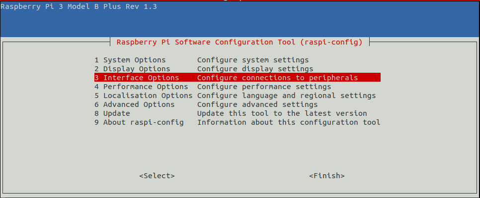
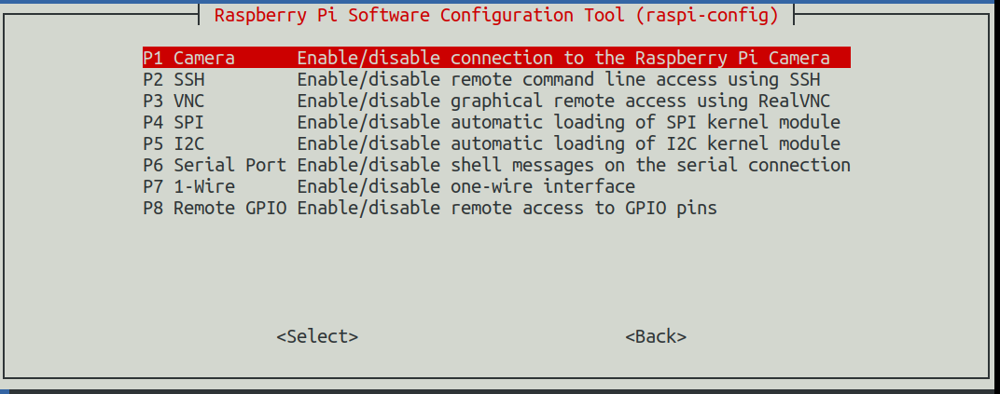
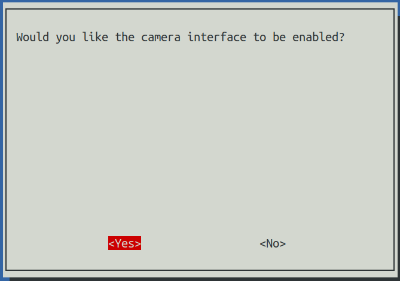

# How to make Nano-duckiebot see
https://www.jetsonhacks.com/2019/04/02/jetson-nano-raspberry-pi-camera/

# How to make Rpi-duckiebot see

### Go to settings and enable camera function.
```
$ sudo raspi-config
```

### Select **Interface Options**


### Select **Camera**


### Press **Yes** to enable camera function


### Reboot Rpi device
```
$ sudo reboot now
```
