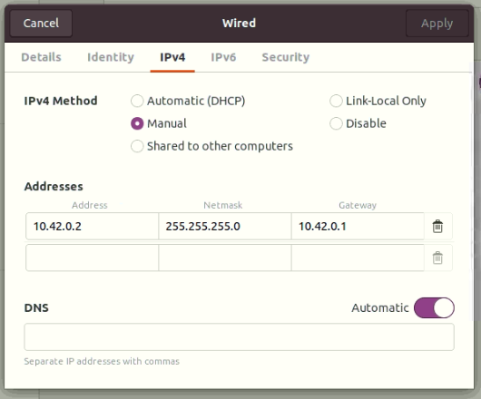
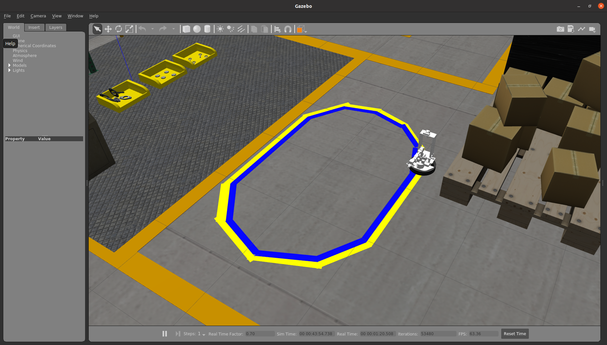
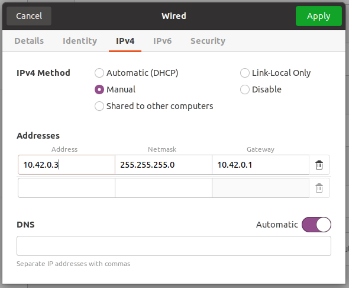

# Hardware-in-the-loop lane following

## Network setup for host PC



## Hsot PC

We will use [locobot_competition](https://github.com/Sensing-Intelligent-System/locobot_competition) repo to open a Gazebo world with yellow and blue lane in it.



## Clone the repo
```
Host PC $ git clone --recursive git@github.com:Sensing-Intelligent-System/locobot_competition.git
```

## Pull the latest docker image
### For CPU machine
```
Host PC $ docker pull argsis/locobot:NUC
```

### For GPU machine
```
Host PC $ docker pull argsis/locobot:GPU
```

### Terminal 1
Launch the environment and a locobot in the simulator.
```
Host PC $ cd ~/locobot_competition
Host PC (with GPU)$ source gpu_run.sh
Host PC (with CPU)$ source cpu_run.sh

Docker $ source catkin_make.sh
Docker $ source environment.sh 10.42.0.2 10.42.0.2
Docker $ roslaunch locobot_competition lane_following.launch world:=lanefollowing
```

### Terminal 2
Set the arm to a better place in order to have a nice view.
```
Host PC $ cd ~/locobot_competition
Host PC (with GPU)$ source gpu_join.sh
Host PC (with CPU)$ source cpu_join.sh

Docker $ load_pyrobot_env
Docker $ python scripts/baseline_navi/setup.py
```

-----

## Network setup for KV260



## KV260

We will SSH into KV260 to launch the lane following node.

### Terminal 1
Pull the latest docker image.
```
Host PC $ ssh ubuntu@10.42.0.3

KV260 $ docker pull argnctu/dt-kv260:latest
```

Download pre-trained weight(.xmodel) from google drive.
```
KV260 $ cd ~/dt-kv260/catkin_ws/src/lane_following/weights
KV260 $ source download_weights.sh
```

Launch lane following node.
```
KV260 $ docker stop $(docker ps -aq)
KV260 $ cd ~/dt-kv260
KV260 $ source docker_run.sh

Docker $ source environment.sh 10.42.0.2 10.42.0.3
Docker $ source catkin_make.sh
Docker $ roslaunch lane_following lane_following.launch
```

### Terminal 2
Publish a virtual trigger to start the lane following.
```
Host PC $ ssh ubuntu@10.42.0.3

KV260 $ cd ~/dt-kv260
KV260 $ source docker_join.sh

Docker $ source environment.sh 10.42.0.2 10.42.0.3
Docker $ rostopic pub /joy sensor_msgs/Joy '{ header: {seq: 0, stamp: {secs: 0, nsecs: 0}, frame_id: ""}, axes: [0.0, 0.0, 0.0, 0.0, 0.0, 0.0], buttons: [0, 0, 0, 0, 0, 0, 0, 1, 0, 0, 0, 0, 0, 0]}'
```
